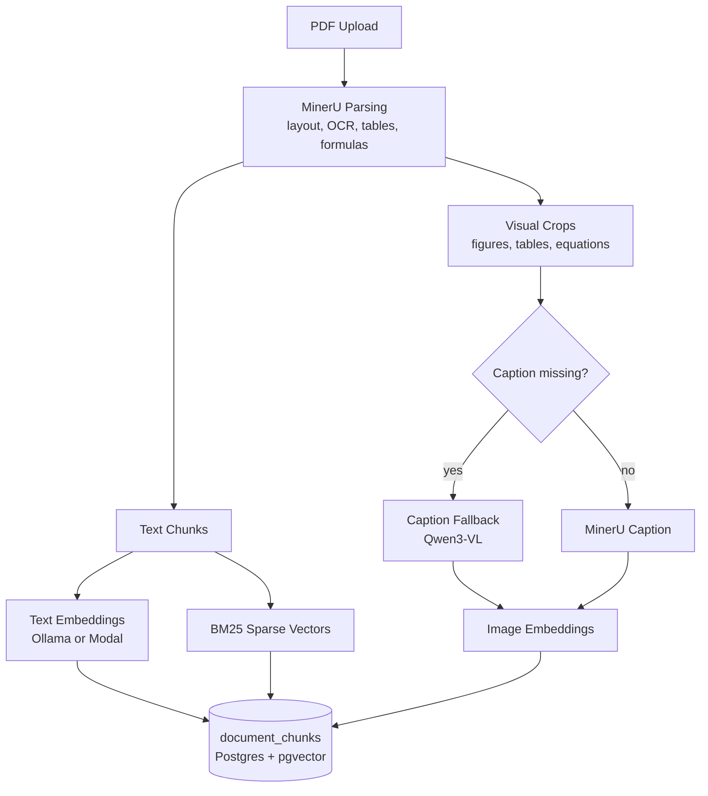
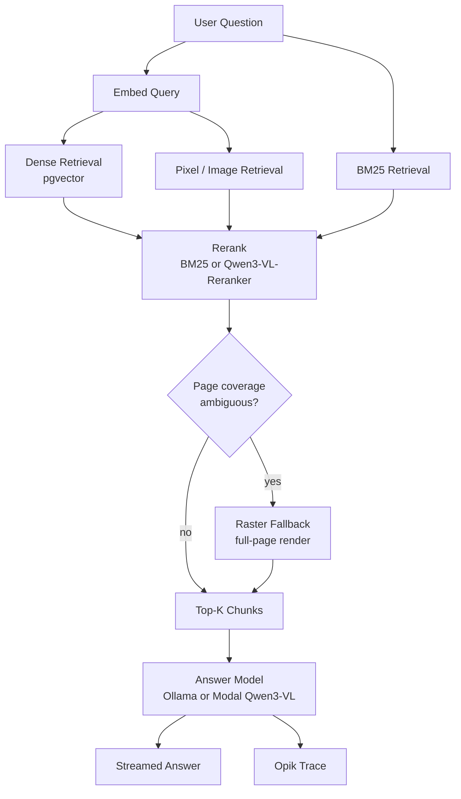

<p align="center">
  
  
</p>

<h1 align="center">GlyphScholar</h1>

<p align="center"><em>Your PDFs have secrets. GlyphScholar reads the fine print so you don't have to.</em></p>

## The problem

PDFs are where information goes to become inconvenient. `Ctrl+F` finds a word but not an idea. Copy-pasting a table gets you one long unreadable string. OCR tools read the text and quietly ignore the formula sitting two lines below it. And the one chart that actually explains the finding? Most text-only RAG pipelines never even look at it — they were built to read words, not pages.

So the usual outcome is: open the PDF, `Ctrl+F` five different phrasings of the same question, scroll past the table twice, and eventually just read the thing properly, forty minutes later than you'd planned.

GlyphScholar exists to skip that part. It parses a document the way a person actually reads one — text, tables, formulas, and page images together — indexes all of it, and lets you ask a plain question and get an answer that's actually grounded in the page it came from, not a guess dressed up in confident prose.

## Demo

<video src="https://github.com/user-attachments/assets/aa8570f4-1be6-4326-ab8d-52122921c60e" controls width="720">
  Your browser does not support inline video. <a href="./demo.mp4">Download the demo</a>.
</video>

## What it actually does

- **Reads PDFs properly** — layout, OCR, tables, and formulas via [MinerU](https://mineru.net/), plus page-image extraction for the diagrams that never survive a text extractor.
- **Finds the right answer, not just a matching keyword** — dense vector search, BM25, and pixel/image retrieval, all combined through a reranking stage, because no single retrieval method is right 100% of the time.
- **Talks back like a chat app should** — a [Chainlit](https://docs.chainlit.io/) interface mounted inside FastAPI, with a Next.js portal handling the parts nobody wants to build twice (login, landing page, etc).
- **Doesn't force you into one GPU bill** — run inference locally via [Ollama](https://ollama.com/) when you're developing, or burst to serverless GPUs via [Modal](https://modal.com/) when it's time to actually serve people.
- **Tells you what it's doing** — full request tracing via [Opik](https://www.comet.com/site/products/opik/), so "the model just made that up" is a debuggable statement, not a shrug.

## Tech stack

FastAPI · Chainlit · Next.js · PostgreSQL (`pgvector`) · Supabase · Modal · Ollama · MinerU · Opik

## Getting started

Full setup lives in **[INSTALL.md](./INSTALL.md)** — hardware and software requirements, every external service (Supabase, Modal, MinerU, Hugging Face, Opik), database migrations, and troubleshooting for when Postgres inevitably complains about an extension.

Once that's done, starting the app is refreshingly anticlimactic:

```bash
npm run dev
```

This runs the portal (`http://localhost:3000`) and the FastAPI backend together. That's it. That's the launch sequence.

## Architecture, in one breath

- **Portal** (`portal/`) — the Next.js frontend, the part with buttons.
- **Backend** (`backend/`) — a FastAPI app (`backend/server.py`) mounting the Chainlit app, handling auth, uploads, and ingestion.
- **Chainlit app** (`chainlit_app/app.py`) — the chat itself, with session history persisted through Supabase.
- **Ingestion** (`backend/ingest.py`, `backend/mineru_client.py`) — turns a PDF into chunks and embeddings, and files them into Postgres/pgvector.
- **Retrieval** (`backend/retrieve.py`) — dense + BM25 + pixel retrieval, reranked before anything reaches the model.
- **Modal services** (`modal/services.py`) — the embedding, reranking, and answer models, deployed as serverless GPU functions.
- **Ollama** — the local stand-in for all of the above, for when you'd rather not wait on a cold GPU start just to test a typo fix.

## The pipeline

Two things happen in this app: a PDF goes *in* once, and questions come *out* many times. Here's what actually happens in each direction, matched to the code that does it.

**Ingestion — one pass per document, in `backend/ingest.py`:**



**Query — one pass per question, in `backend/retrieve.py` and `chainlit_app/app.py`:**



**Ingestion, once per document.** A PDF goes to [MinerU](https://mineru.net/) for layout-aware parsing — this is what separates a real table from three paragraphs pretending to be one. The result splits into text chunks and visual crops (figures, tables, equations); crops without a caption get one generated via Qwen3-VL rather than being left mute. Text gets embedded (`nomic-embed-text` locally via Ollama, or `Qwen3-VL-Embedding` on Modal) and turned into BM25 sparse vectors; crops get their own image embeddings. Everything lands in `document_chunks`, a Postgres table wearing a `pgvector` extension.

**Query, once per question.** A question is embedded and fired down three retrieval paths at once — dense vector search, pixel/image retrieval, and BM25 — because relying on any single one means missing whatever it happens to be bad at. The candidates get reranked (BM25 locally, or a Qwen3-VL reranker on Modal), and if page coverage still looks ambiguous, a full-page raster fills the gap rather than guessing. The winning chunks get stitched into the prompt, handed to the answer model, and streamed back through Chainlit — with an [Opik](https://www.comet.com/site/products/opik/) trace recording the whole trip, so a wrong answer is something you can actually investigate.

## Project structure

```
.
├── backend/          # FastAPI app, ingestion, retrieval, migrations
├── chainlit_app/      # Chainlit chat UI
├── modal/             # Serverless GPU inference services
├── portal/            # Next.js frontend
├── supabase/          # Supabase project config + migrations
└── public/            # Chainlit theme, logos, avatars
```

## Roadmap / future improvements

Not promises, not a backlog carved in stone — just the honest list of things worth doing next, in roughly the order they'd stop being embarrassing to skip:

- [ ] **Automated tests** — there isn't a test suite yet (see [CONTRIBUTING.md](./CONTRIBUTING.md)); at minimum, coverage for the ingestion chunking logic and the retrieval fallback paths would catch regressions before a user does.
- [ ] **CI** — lint and (once they exist) tests running on every PR, instead of "it worked on my machine."
- [ ] **Containerized setup** — the current setup is Homebrew-and-prayer (see [INSTALL.md](./INSTALL.md)); a `docker-compose.yml` for Postgres + pgvector + Ollama would cut a lot of onboarding friction.
- [ ] **Non-PDF uploads in the UI** — MinerU's client already accepts Word and PowerPoint files; surfacing that in the portal's upload flow is mostly plumbing at this point.
- [ ] **Cross-document Q&A** — answering from more than one ingested document in the same conversation, rather than one document per session.
- [ ] **Usage limits, visibly** — `PDF_RENDER_QUOTA_MULTIPLIER` already exists in the backend config; showing remaining quota in the portal UI would make it a feature instead of a mystery.
- [ ] **Self-hosted embedding/rerank option** — a path that needs neither Ollama nor Modal, for anyone who'd rather run everything on their own GPU box.

Have an idea that's not here? Open an issue using the [feature request template](./.github/ISSUE_TEMPLATE/feature_request.md) — this list is meant to grow.

## Contributing

Bug reports, feature ideas, and pull requests are all welcome — see [CONTRIBUTING.md](./CONTRIBUTING.md) for how to get set up and what a good PR looks like. Everyone participating is expected to follow the [Code of Conduct](./CODE_OF_CONDUCT.md).

## License

This project is licensed under the [MIT License](./LICENSE) — see the `LICENSE` file for the full text.
